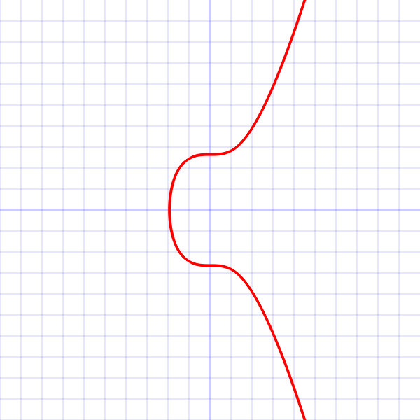

# 基础概念
### ECDSA
ECDSA（Elliptic Curve Digital Signature Algorithm）即椭圆曲线数字签名算法，是用于基于椭圆曲线私钥/公钥对的数字签名的算法。比特币中使用的数字签名算法是椭圆曲线数字签名算法。

椭圆曲线公式：
y^2 = (x^3 + a * x + b) mod p

更多信息可查看 https://zhuanlan.zhihu.com/p/97953640

#### 生成私钥/公钥
Qa = dA * G
- G = 在椭圆曲线上选择的一个基点
- dA = 随机生成的数字私钥
- Qa = 公钥

#### 签名过程如下：
1. 选择一条椭圆曲线Ep(a,b)，和基点G
2. 产生一个随机整数k，20字节，利用点乘法计算 P = k * G
3. 点P的x坐标为R
4. 利用SHA1计算信息的哈希，得到一个20字节的巨大的整数m
5. 利用方程 S = k^-1 (m + dA * R) mod p 计算 S
签名本身是40字节，由各20字节的两个值来进行表示，第一个值叫作R，第二个叫作S。值对（R，S）放到一起就是你的ECDSA签名

#### 验证过程如下：
1. 接受方在收到消息(m)和签名值(R,S)后，进行以下运算
2. 计算点P：P = S^-1 * m * G + S^-1 * R * Qa
3. 如果点P的x坐标与R相等，则接受签名，否则签名无效。

### Secp256k1 
Secp256k1是指比特币中使用的ECDSA(椭圆曲线数字签名算法)曲线的参数，并且在高效密码学标准（Certicom Research，http://www.secg.org/sec2-v2.pdf ） 中进行了定义。


这是secp256k1的椭圆曲线 y^2 = x^3 + 7 在实数域上的图

相关参数可查看 https://en.bitcoin.it/wiki/Secp256k1

# 代码实战
### 通过 mnemonic 获取 address
根据 bip39 协议将 mnemonic 转成 seed
```Dart
final seed = bip39.mnemonicToSeed(mnemonic);
// seed = [89, 193, 170, 8, 55, 69, 108, 117, 27, 129, 45, 13, 149, 189, 105, 56, 228, 202, 47, 231, 143, 188, 138, 30, 232, 25, 6, 243, 140, 220, 137, 21, 69, 60, 171, 211, 242, 116, 143, 161, 139, 216, 223, 195, 200, 50, 237, 211, 0, 2, 136, 40, 151, 99, 212, 102, 26, 13, 248, 151, 107, 251, 33, 182]
```

使用 seed 产生 bip32 实例，即产生 HD Wallet 的 Master Key 并记录起来
```Dart
final node = bip32.BIP32.fromSeed(seed);
```

根据生成路径 path 获取 HD Wallet 中第一个帐户的第一组 keypair
```Dart
String path = "m/44'/23808'/0'/0/0";
final child = node.derivePath(path);
// privateKey = 8c44ff31bf84292b316aee425b4ebb1b3e95fcf790fd163c8d5fa64418706f7d
// publicKey = 03a7995337fa0bb7aa965a7a3640bb878c8c0e0391fcefd827996c65681299b717
```

计算公钥的 HASH160（sha256+ripemd160）值，得到20位字节地址
```Dart
final words = child.identifier;
// words = [205, 151, 130, 67, 136, 66, 220, 162, 162, 139, 7, 203, 180, 50, 42, 73, 181, 59, 48, 175]
```

通过 Bech32 编码得到 address
```Dart
String address = Bech32Encoder.encode(bech32MainPrefix, words);
// address = kuchain1ektcysuggtw29g5tql9mgv32fx6nkv90r98h9r
```

### 通过 secp256k1 ECDSA 算法对交易签名
通过 /sign_msg/encode 接口序列化交易信息
```Dart
final rsp = await getStdSignMsg(stdSignMsg);
var signMsg = jsonDecode(rsp.body);
// signMsg = {msg: eyJhY2NvdW50X251bWJlciI6IjEiLCJjaGFpbl9pZCI6InRlc3RpbmciLCJmZWUiOnsiYW1vdW50IjpbeyJhbW91bnQiOiIxMDAiLCJkZW5vbSI6Imt1Y2hhaW4va2NzIn1dLCJnYXMiOiIyMDAwMDAifSwibWVtbyI6InNlbmQgdmlhIGt1Y2hhaW4iLCJtc2ciOlt7ImFjdGlvbiI6ImNyZWF0ZSIsImFtb3VudCI6W10sImF1dGgiOlsia3VjaGFpbjFmaHFqaHMyMnM0Y3d2anhydmxjeXN0M2g0cHZ3N3g0OWp2azB1eCJdLCJkYXRhIjoiUkp6bytld0tFd29SQVFFRUJERGhBQUFBQUFBQUFBQUFBQUFTRXdvUkFRRUVCRERpQUFBQUFBQUFBQUFBQUFBYUZFM0JLOEZLaFhEbVNNTm44RWd1TjZoWTd4cWwiLCJmcm9tIjoiYWNjMSIsInJvdXRlciI6ImFjY291bnQiLCJ0byI6ImFjYzIifV0sInNlcXVlbmNlIjoiMSJ9}
```

对message 进行 base64 解码
```Dart
final msgData = base64Decode(signMsg['msg'] as String);
// msgData = [123, 34, 97, 99, 99, 111, 117, 110, 116, 95, 110, 117, 109, 98, 101, 114, 34, 58, 34, 49, 34, 44, 34, 99, 104, 97, 105, 110, 95, 105, 100, 34, 58, 34, 116, 101, 115, 116, 105, 110, 103, 34, 44, 34, 102, 101, 101, 34, 58, 123, 34, 97, 109, ...]
```

对数据进行 SHA-256 编码
```Dart
final hash = SHA256Digest().process(msgData);
// print(HEX.encode(hash));
// d415fa76081c0f80358583754e8c70cda7b556f623c7fd6e7109347624e062cd
```

对数据进行 ECDSA 签名
```Dart
ECPrivateKey ecPrivateKey = _getECPrivateKey(ecpairPriv);
ECPublicKey ecPublicKey = _getECPublicKey(ecPrivateKey);
final signObj = TransactionSigner.deriveFrom(hash, ecPrivateKey, ecPublicKey);
// signObj = [212, 239, 145, 249, 255, 228, 35, 1, 163, 10, 195, 82, 177, 28, 30, 80, 170, 213, 136, 248, 5, 144, 114, 79, 51, 245, 183, 73, 205, 64, 92, 94, 113, 67, 112, 4, 204, 62, 74, 85, 95, 2, 246, 244, 22, 99, 35, 31, 5, 247, 159, 75, 169, 185, 61, 224, 193, 67, 27, 232, 80, 33, 197, 84]
```

对签名进行 base64 编码
```Dart
final signatureBase64 = base64Encode(signObj);
// signatureBase64 = 1O+R+f/kIwGjCsNSsRweUKrViPgFkHJPM/W3Sc1AXF5xQ3AEzD5KVV8C9vQWYyMfBfefS6m5PeDBQxvoUCHFVA==
```

返回签名结果
```Dart
return {
  "tx": {
    "msg": stdSignMsg['msg'],
    "fee": stdSignMsg['fee'],
    "signatures": [
      {
        "signature": signatureBase64,
        "pub_key": {
          "type": "tendermint/PubKeySecp256k1",
          "value": getPubKeyBase64(ecpairPriv)
        }
      }
    ],
    "memo": stdSignMsg['memo']
  },
  "mode": modeType
};
```